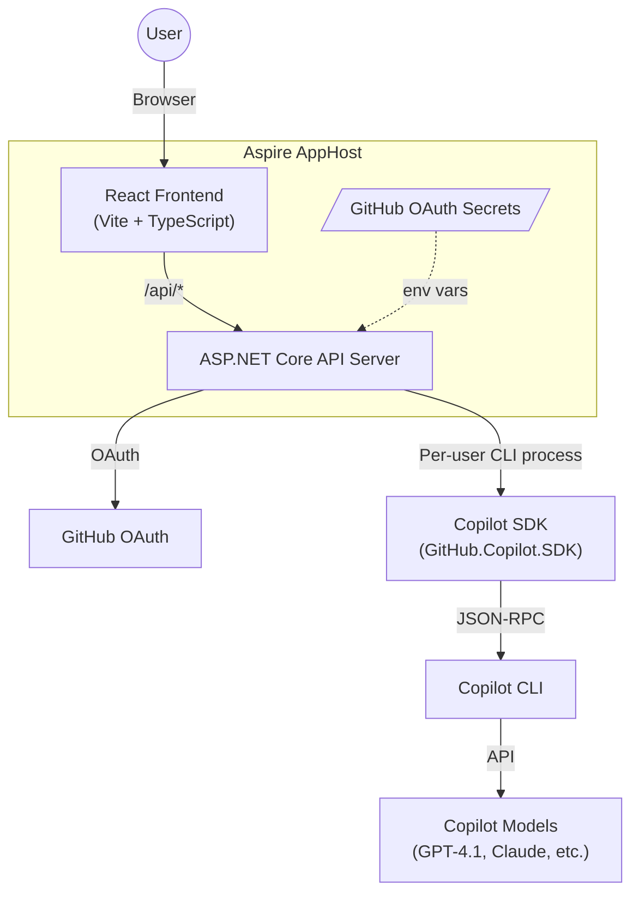

# Copilot SDK Web App

A full-stack chat application built with the [GitHub Copilot SDK](https://github.com/github/copilot-sdk), [.NET Aspire](https://aspire.dev), and React. Authenticate with GitHub OAuth and chat with Copilot models through a browser UI, with full session history and model selection.


## Architecture



Each authenticated user gets their own Copilot CLI process via the SDK, with sessions persisted by the Copilot runtime.

## Features

- **Chat with Copilot** — Multi-turn conversations powered by the Copilot SDK
- **Model selection** — Choose from all available Copilot models (GPT-4.1, Claude Sonnet, etc.)
- **Session history** — Browse, resume, and delete past conversations (SDK-native session persistence)
- **GitHub OAuth** — Secure authentication with the `copilot` scope
- **.NET Aspire** — Orchestrated local development with health checks, OpenTelemetry, and service discovery

## Prerequisites

- [.NET 10 SDK](https://dotnet.microsoft.com/download)
- [Node.js 18+](https://nodejs.org/)
- [GitHub Copilot CLI](https://docs.github.com/en/copilot/how-tos/set-up/install-copilot-cli) installed and on PATH
- A [GitHub OAuth App](https://github.com/settings/developers) with the callback URL `https://localhost:7459/auth/callback`

## Getting Started

### 1. Clone the repo

```bash
git clone https://github.com/aaronpowell/copilot-sdk-web-app.git
cd copilot-sdk-web-app
```

### 2. Configure GitHub OAuth secrets

The AppHost uses Aspire parameters for the OAuth credentials. Set them via user secrets:

```bash
cd CopilotSdkWebApp.AppHost
dotnet user-secrets set "Parameters:github-client-id" "<your-client-id>"
dotnet user-secrets set "Parameters:github-client-secret" "<your-client-secret>"
```

### 3. Run with Aspire

```bash
aspire run
```

This starts all resources — the API server, frontend dev server, and Aspire dashboard. The dashboard URL will be printed to the console.

Open the frontend (typically `http://localhost:<port>` shown in the dashboard), sign in with GitHub, and start chatting.

## Project Structure

| Project | Description |
|---|---|
| `CopilotSdkWebApp.AppHost` | Aspire orchestrator — wires up server, frontend, and secrets |
| `CopilotSdkWebApp.Server` | ASP.NET Core API — OAuth, chat, sessions, and models endpoints |
| `frontend` | React + TypeScript + Vite — Chat UI with session sidebar |
| `CopilotSdkWebApp.Hosting` | Custom Aspire hosting integration for the Copilot CLI (retained for reference) |

### Key API Endpoints

| Method | Path | Description |
|---|---|---|
| `POST` | `/api/chat` | Send a message (creates or resumes a session) |
| `GET` | `/api/sessions` | List past sessions |
| `GET` | `/api/sessions/{id}/messages` | Get messages for a session |
| `DELETE` | `/api/sessions/{id}` | Delete a session |
| `GET` | `/api/models` | List available Copilot models |

## Tech Stack

- **Backend**: .NET 10, ASP.NET Core Minimal APIs, [GitHub.Copilot.SDK](https://www.nuget.org/packages/GitHub.Copilot.SDK)
- **Frontend**: React 19, TypeScript 5.9, Vite 7
- **Orchestration**: .NET Aspire 13.1
- **Auth**: GitHub OAuth with cookie authentication

## License

[MIT](LICENSE)
